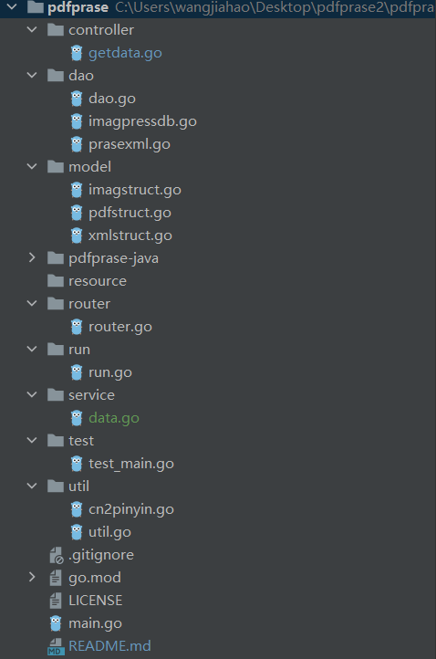
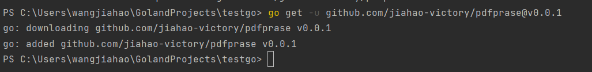
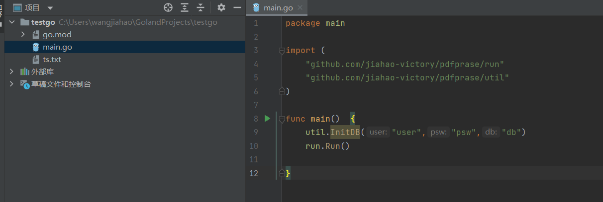

# pdfprase
对PDF文件进行解析的一个基本框架，同时支持其他文件扩展
## 环境
1. jdk1.8
2. go 1.19.3
## 使用方法
1. 打开pdfprase-java文件,进入src文件夹下

    下面介绍一下封装好的JAVAPDF解析工具代码集
  ```azure
C:.
    │  fileDelete.java    //删除文件
    │  ExtractTableDataAndSaveInExcel.java    //提取PDF文件中的表格并转换成EXCEL
    │  mergePdf3.java    // 合并PDF文件
    │  mysqlDemo.java    //javaPDF文件内容写入数据库
    │  pdfCreateDir.java    //创建PDF文件夹
    │  pdfGetImageSecond.java    //获取PDF中文件图片
    │  pdfGetTextFromtika.java   //获取PDF中的文本
    │  pdfSplit.java    //拆分文件
    │  xml2json.java    //解析xml文件转JSON文件
    │
└─META-INF
        MANIFEST.MF

```
2. 这些是最基本的PDF解析相关封装文件，如果你有更好的想法，可以对其进行添加和封装。
3. 如果你需要哪个PDF解析模块，那么请将他构建成工件，便于操作,构建工件教程为:https://blog.csdn.net/weixin_47160526/article/details/123496190
4. 构建完成后，请将其放到对应的根目录下
5. main.go是本项目入口函数，你可以直接在本项目基础上进行开发（以约定进行开发），或者使用

```
go get -u github.com/jiahao-victory/pdfprase@v0.0.1
```
然后在你自己的项目中
```azure
import "github.com/jiahao-victory/pdfprase"
```
你就可以使用该框架了
## 框架目录介绍

该项目可以以模块形式进行集成到系统中也可以作为一个解析工具在本地运行
* controller模块编写对应的控制层，在service层获取对应的数据
* dao用于解析图片，文字，xml文件等自定以解析文件，目前该框架只支持图片压入数据库，关键字格式化压入数据库，xml压入数据库
* model模型，根据不同解析文件定义对应的模型
* resource存放对应的PDF文件,当然你也可以自定义路径，默认是当前运行项目路径，所以只需要在你运行项目对应的目录下生成即可
* router路由，根据对应的API接口在后台进行获取
* run，并发执行，工具启动入口，目前包含文字提取，图片提取，文字存储
* service，服务层，获取对应数据库中的数据
* test，测试文件和demo
* util，目前含有两个工具，中文转拼音和数据库初始化
* main.go程序入口，可在本项目进行开发直接使用，也可以不使用，作为框架使用对应的解析函数及解析工具
### 使用方式-在本项目上进行开发
```azure
func main() {
	util.InitDB()
	var openApi string
	flag.StringVar(&openApi,"openapi","close","isopenapi?")
	flag.Parse()
	if openApi=="open"{
		fmt.Println("请等pdf解析完毕，api接口自动开放")
		Run()
		router.Run()
		fmt.Println("pdf解析完毕，api接口开放，请访问本地:8080")
	}else{
		Run()
    }
}
```
### 使用方式-以框架的方式在自己的项目上进行开发


```azure
package main

import (
	"github.com/jiahao-victory/pdfprase/run"
	"github.com/jiahao-victory/pdfprase/util"
)

func main()  {
	util.InitDB("user","psw","db")
	run.Run()
	
}
```